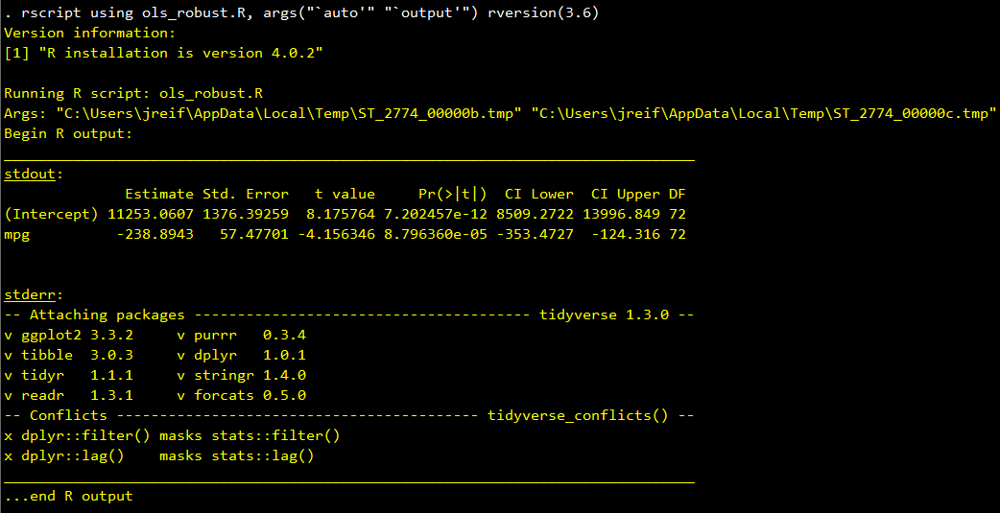

# RSCRIPT: call an *R* script from Stata.

- Current version: `1.0.4 25nov2020`
- Jump to: [`overview`](#overview) [`installation`](#installation) [`usage`](#usage) [`tutorial`](#tutorial) [`update history`](#update-history) [`authors`](#authors)

-----------

## Overview 

`rscript` is a [Stata](http://www.stata.com) command that runs an external *R* script within Stata. `rscript` makes debugging and logging easy by displaying *R* output and error messages in the Stata console and exiting Stata in error when the *R* script ends in error.

## Installation

```stata
* Determine which version of -rscript- you have installed
which rscript

* Install the most recent version of -rscript-
net install rscript, from("https://raw.githubusercontent.com/reifjulian/rscript/master") replace
```

## Usage

`rscript` works by calling the Rscript executable that comes with your *R* installation. You can (optionally) specify the location of this executable using the  option `rpath(pathname)` or by specifying the global macro `RSCRIPT_PATH`. If you don't specify a path, `rscript` will try to find Rscript on its own by searching commonly used paths. The following code demonstrates all three usages.

```stata
* Use the -rpath()- option to specify the path to the Rscript executable
rscript using filename.R, rpath("C:/Program Files/R/R-X.Y.Z/bin/Rscript.exe")

* Use global macro RSCRIPT_PATH to specify the path to the Rscript executable
global RSCRIPT_PATH "C:/Program Files/R/R-X.Y.Z/bin/Rscript.exe"
rscript using filename.R

* Let rscript search for the executable on its own
rscript using filename.R
```

On Mac/Linux, the Rscript path is typically `/usr/local/bin/Rscript` or `/usr/bin/Rscript`. On Windows, the path for R version X.Y.Z is typically `C:/Program Files/R/R-X.Y.Z/bin/Rscript.exe`.

For more details, see the Stata help file included in this package.

## Tutorial 

This tutorial assumes you have [installed](#install) the `rscript` Stata package and have successfully installed *R*, which is freely available [online](https://www.r-project.org). You also need to install the following *R* packages: `tidyverse`, `haven`, and `estimatr`. Install these packages by opening *R* and executing the following three lines of code:

```R
install.packages('tidyverse', repos='http://cran.us.r-project.org')
install.packages('haven', repos='http://cran.us.r-project.org')
install.packages('estimatr', repos='http://cran.us.r-project.org')
```

We will write a Stata script that calls an *R* script, **ols_robust.R**, and feeds it an input filename and an output filename. The *R* script will read the input file, estimate an OLS regression with robust standard errors, and write the results to the output file. Here is the code for **ols_robust.R**:

```R
# Required libraries. You may need to install them first, e.g., install.packages('tidyverse', repos='http://cran.us.r-project.org')
library(tidyverse)
library(haven)
library(estimatr)

# Parse arguments (if present)
args = commandArgs(trailingOnly = "TRUE")
if (length(args)) {
  arg1 <- args[1]
  arg2 <- args[2]
} else {
  arg1 <- "C:/Program Files/Stata16/ado/base/a/auto.dta"
  arg2 <- "output.csv"
}

# Estimate OLS model with robust standard errors and display output
my_data <- read_dta(arg1)
ols <- lm_robust(price ~ mpg, data = my_data, se_type = "HC1")
ols

# Outsheet OLS results
write_csv(tidy(ols), arg2)

## EOF
```
Here is the Stata script:

```stata
* Stata: OLS with robust standard errors
sysuse auto, clear
reg price mpg, robust

* R: OLS with robust standard errors
tempfile auto output
save "`auto'", replace
rscript using ols_robust.R, args("`auto'" "`output'")

* Read in the R results
insheet using "`output'", comma clear
list
```

The Stata script begins by running the OLS regression in Stata


We then save the dataset into a tempfile and call the *R* script that we wrote. `rscript` reports that we are calling **ols_robust.R** and feeding it two arguments, which correspond to the names of the two tempfiles. `rscript` also reports the output produced by *R*. We can see here that the point estimates and standard errors are the same as those that were computed by Stata. (Don't worry about the `tidyverse` conflicts that are also reported. These namespace conflicts are quite common in *R*.)



Finally, we read in the results that were outputted from *R* into Stata and display them. We again have confirmation that that the point estimates and standard errors are the same in both Stata and *R*. 


## Update History
* **November 25, 2020**
  - `rscript` now searches for the R executable if `RSCRIPT_PATH` undefined and `rpath()` not specified
* **March 23, 2020**
  - Added support for pathnames with "~"
* **September 4, 2019**
  - stderr is now parsed by Mata rather than Stata
* **May 2, 2019**
  - Default path is now set by the global macro `RSCRIPT_PATH`
* **January 22, 2019**
  - Added `force` option

## Authors:

[David Molitor](http://www.davidmolitor.com)
<br>University of Illinois
<br>dmolitor@illinois.edu

[Julian Reif](http://www.julianreif.com)
<br>University of Illinois
<br>jreif@illinois.edu
